# ProteinInteractionHunter 詳細設計書

| 項目 | 内容 |
|---|---|
| 文書種別 | MVP-0 詳細設計・既存資産監査 |
| 対象システム | ProteinInteractionHunter（独立プロジェクト） |
| 想定配置先 | `/home/nyako/projects/ProteinInteractionHunter` |
| 監査対象 | `/home/nyako/projects/ProteinHunter_v5` |
| 監査基準コミット | `9a26dbe498412ce34eab57f783382ba2f9c505b4` |
| 作成日 | 2026-07-25 |
| ステータス | Design only（実装・新規リポジトリ作成・commit・pushなし） |

> **重要な境界**  
> ProteinInteractionHunterはProteinHunter_v5の追加機能ではない。両者の実行環境、設定、データモデル、キャッシュ、出力、テストを分離し、ProteinHunter_v5を直接importしない。AlphaFold 3、AlphaFold Server、ColabFold等の複合体構造予測は自動実行せず、初期ランキングにも構造予測結果や「予測しやすさ」を加点しない。

## 目次

1. [Executive Summary](#1-executive-summary)
2. [Scope](#2-scope)
3. [User Stories](#3-user-stories)
4. [Input Specification](#4-input-specification)
5. [Output Specification](#5-output-specification)
6. [System Architecture](#6-system-architecture)
7. [Core Data Models](#7-core-data-models)
8. [Candidate Generation](#8-candidate-generation)
9. [Evidence Engines](#9-evidence-engines)
10. [Scoring Model](#10-scoring-model)
11. [Contradiction and Exclusion Rules](#11-contradiction-and-exclusion-rules)
12. [Structure Prediction Queue](#12-structure-prediction-queue)
13. [Configuration Design](#13-configuration-design)
14. [Reproducibility and Provenance](#14-reproducibility-and-provenance)
15. [Error Handling](#15-error-handling)
16. [Performance and Scalability](#16-performance-and-scalability)
17. [Testing Strategy](#17-testing-strategy)
18. [MVP Roadmap](#18-mvp-roadmap)
19. [Security and External Service Policy](#19-security-and-external-service-policy)
20. [Open Questions and Decisions Required](#20-open-questions-and-decisions-required)
21. [ProteinHunter_v5 Extraction Audit](#21-proteinhunter_v5-extraction-audit)

---

## 1. Executive Summary

### 1.1 目的

ProteinInteractionHunterは、特定の1生物種に属する1つまたは複数のquery proteinを起点に、同一proteome内の全タンパク質を候補集合として、物理的相互作用または機能的関連の可能性を**証拠別に評価し、順位付けするローカル中心の研究支援CLI**である。

本システムの出力は「相互作用する」という断定ではなく、研究者が次の実験、文献確認、または手動複合体構造予測へ進む候補を選ぶための、追跡可能な仮説一覧である。

### 1.2 ProteinHunterとの違い

| 観点 | ProteinHunter_v5 | ProteinInteractionHunter |
|---|---|---|
| 主目的 | 特定の生化学反応・修飾・機能に関与する候補の探索 | 指定queryと同一生物種内で関係する候補の探索 |
| 候補生成の中心 | positive/negative参照proteomeへのBLAST分類 | queryを除く対象proteome全体 |
| 主な判定 | positive hit、negative hit、機能固有語彙 | 物理・機能・文脈・進化・矛盾の独立証拠 |
| 結果の意味 | 目的機能の候補 | query–candidate関係仮説 |
| 構造情報 | AlphaFold URLやreadinessを既存scoreに利用し得る | 初期ランキングから完全分離、手動解析queueのみ |
| 結合方針 | 既存コードベース | 独立package。既存を直接importしない |

### 1.3 主要な設計判断

1. **証拠をイベント単位で保存する。** 集計scoreだけでなく、source、対象protein、exact/ortholog transfer、品質、欠損、矛盾、取得日時をJSONLに保存する。
2. **physical interactionとfunctional associationを別scoreにする。** 同じoperon、同じprocess、同じdomain、paralogyを直接結合の証明にしない。
3. **欠損と否定を分離する。** `not_observed`、`not_applicable`、`not_run`、`failed`、`observed_negative`を区別し、absence of evidenceを減点しない。
4. **候補を早期除外しない。** `included / down_ranked / flagged / excluded`を明示し、hypothetical proteinや低annotation候補を保持する。
5. **外部サービスはoptional adapterとする。** local-only modeでは外部通信なしでMVP-1が完了する。
6. **決定論的ランキングとprovenanceを優先する。** 入力hash、設定snapshot、tool/database version、cache hit、警告をrunごとに固定保存する。
7. **構造予測queueはランキング後の派生物とする。** 構造予測の実行容易性、pair長、AlphaFold既存モデル有無を生物学的相互作用scoreへ加えない。
8. **ProteinHunter_v5からの移植はclean-roomに近い一般化を行う。** 明示的なLICENSEが監査時点で見つからないため、権利確認前にコードコピーしない。

### 1.4 MVPで達成する範囲

MVP-1は、proteome FASTA、GFF/GFF3、query ID、organism nameを入力とし、全候補についてID正規化、配列品質、gene distance、近傍、operon proxy、annotation統合、rule-based functional complementarity、局在annotation互換性、透明なscore、矛盾、Evidence Tierを計算する。Excel、TSV、JSONL、manifest、log、config snapshot、手動構造予測queue、FASTAを出力し、外部APIなしで完了する。

Orthology、phylogenetic profile、conserved neighborhood、fusionはMVP-2、既知interaction databaseや外部domain/localization serviceはMVP-3とする。

### 1.5 AlphaFold 3を自動化しない理由

- 利用規約、認証、rate limit、private sequence送信の判断をCLIが代行すべきでない。
- 非構造証拠で候補を絞る前の自動投入は計算資源とレビューコストを浪費する。
- 構造モデルはinteractionの実験的証明ではなく、初期scoreへ混ぜると循環的な確信を生む。
- RNA、DNA、metal、cofactor、ligand、stoichiometryは研究者の生物学的判断が必要である。
- 手動結果を後から独立した`StructureEvidence`としてimportする方が、非構造rankingの再現性を保てる。

---

## 2. Scope

### 2.1 In scope

- 1生物種のproteome内で、1個以上のqueryごとに候補を生成・順位付けする。
- FASTA、GFF/GFF3、任意のGenBank、annotation tableを正規化する。
- query自身、duplicate、isoform、paralog、fragment、pseudogene等を識別・flag付けする。
- gene context、operon proxy、distance、conserved neighborhood、phylogenetic profile、functional/domain complementarity、fusion、localization/topology、known interaction、literature、annotation quality、completeness、contradictionを独立保存する。
- physical / stable complex / transient / enzyme–substrate / indirect pathway等を区別した関係タイプを推定する。
- Excel、TSV、JSONL、log、manifest、config snapshot、構造予測queue、FASTAを生成する。
- local-only、offline再実行、cache、resume、incremental rerunを支援する。
- bacteriaとarchaeaをMVPの中心にしつつ、真核生物のisoform/compartment情報を保持できるschemaにする。

### 2.2 Out of scope

- AlphaFold 3、AlphaFold Server、ColabFold、その他構造予測サービスの自動実行。
- 構造予測サイトへの自動Web投稿、browser automation、web scraping。
- API制限、認証、rate limit、利用規約を回避する処理。
- 物理的相互作用、複合体形成、基質関係の断定。
- 実験的検証の代替。
- query proteinを指定しない完全な全対全構造予測。
- 自動的なwet-lab protocol生成や実験装置制御。
- 外部database coverageがないことをnegative evidenceとみなすこと。
- MVP-1での系統樹推定、de novo orthogroup構築、文献全文自動解釈。

### 2.3 Future scope

- reference proteome群を用いたorthogroup、phylogenetic profile、conserved neighborhood、fusion検出。
- STRING、IntAct、BioGRID、UniProt、Complex Portal等のoptional connector。
- SignalP/TMHMM系、DeepLoc系、coiled-coil、low-complexity等のlocal tool adapter。
- 手動AlphaFold 3結果や他の構造予測結果のimportと、非構造scoreから分離したstructure score。
- 明示的opt-in時のみのstructure-aware reranking。
- expert-curated ruleset package、taxon別preset、calibrated model。
- HTML reportまたはread-only UI。ただしCLI/portable artifactを正本とする。

---

## 3. User Stories

1. 研究者として、proteomeとGFFを指定し、既知query IDから候補を順位付けしたい。
2. 複数queryを一度に解析し、queryごとのrankingと共有候補を比較したい。
3. 候補ごとに、加点、欠損、矛盾、provenanceを別々に確認したい。
4. physical interaction候補と、単なるpathway associationやfunctional similarityを区別したい。
5. hypothetical proteinをannotation不足だけで除外せず、gene context等から検討したい。
6. 既知interaction情報がない非モデル生物やarchaeaでも解析したい。
7. 外部APIが停止してもローカル証拠だけでrunを正常完了したい。
8. 高順位候補のquery FASTA、candidate FASTA、pair FASTAを取得し、手動構造予測へ渡したい。
9. 同じ入力・version・configから同じrankingを再現したい。
10. exact proteinへの証拠と、orthologから転送された証拠を区別したい。
11. positive/negative既知例を任意入力し、rankingのsanity checkに使いたいが、教師データがなくても実行したい。
12. 外部通信前に送信対象とサービスを確認し、private sequenceはlocal-onlyにしたい。

受入条件は、各storyがCLI、artifact、warningのいずれかで観察可能であり、外部サービスなしのE2E fixtureでstory 1–9が検証できることである。

---

## 4. Input Specification

### 4.1 入力共通規則

- text encodingはUTF-8をdefaultとし、BOMは許容する。
- inputは変更せず、`normalized_inputs/`へ正規化コピーまたは派生表を出力する。
- 全fileについてSHA-256、byte size、mtime、絶対path、取得元URI/assembly accession（提供時）、database release、license noteをmanifestへ記録する。
- protein IDのcanonical keyは入力IDそのものを保持し、照合用aliasを別tableにする。version suffixを黙って削除して上書きしない。
- ID衝突は`canonical_id + source_namespace + sequence_hash`で識別し、曖昧な自動統合をしない。

### 4.2 入力一覧

| 入力 | 必須 | Format / required fields | ID・重複・欠損 | 期待規模 | 検証と失敗挙動 |
|---|---:|---|---|---:|---|
| Proteome FASTA | Yes | FASTA。header ID、amino-acid sequence | ID一意が原則。重複IDは配列同一ならduplicate group、異なるならfatal。空配列不可 | 1,000–10,000、上限警告100,000 | file/record/文字集合/query存在を検証。読めない場合fatal |
| Genome GFF3/GFF | Yes（MVP-1） | 9列、CDS/gene、seqid/start/end/strand/attributes。protein_id/ID/Parent/locus_tagのいずれか | FASTAとのalias tableを作る。未対応recordはwarning | 数千〜数十万行 | 座標逆転・非整数はrecord error。照合率が閾値未満ならfatalまたは明示override |
| Query specification | Yes | YAML listまたはTSV。`query_id`、`protein_id`。任意`sequence`、`old_locus_tag` | 同一canonical proteinの重複queryはdefault fatal、`deduplicate_queries`で統合可 | 1–100 | IDがproteomeにない場合fatal。明示sequenceとproteome配列不一致はfatal |
| Organism name | Yes | 非空string。任意taxonomy ID、assembly accession | 正規名を保持し自動推測しない | 1 organism | 空欄fatal。taxonomy照合はoptional warning |
| Annotation table | No | TSV/CSV/Parquet。`protein_id`必須、任意`gene_name`,`product`,`function`,`go_terms`,`ec`,`pathway`,`localization`,`evidence_code`,`source` | 1 protein複数行可。値をsource別evidenceに展開 | proteome同等 | ID不一致行はquarantine。列不足はfatal（その入力のみ） |
| GenBank | No | GenBank flat file。feature qualifiersとsequence | GFF/FASTAとの不一致を矛盾として記録 | assembly相当 | parser failureはrecoverable。GFFを正本とするdefault |
| Reference proteomes | No（MVP-2） | FASTA + metadata table。`reference_id`,`taxon_id`,`path`,`assembly`,`quality` | taxon/strain重複をcluster化 | 10–1,000 proteomes | 欠損referenceはskip、coverage低下を記録 |
| Positive interaction proteins | No | TSV/FASTA。`protein_id`またはsequence、任意query_id、relationship、source | exact/orthologを明記。未解決はquarantine | 0–数百 | rankingの校正・評価用。存在しなくても正常 |
| Negative/implausible proteins | No | TSV/FASTA。上記に加え`reason`推奨 | hard negativeとunknownを混同しない | 0–数百 | 自動hard exclusionには使わず、明示config時のみ評価/penalty |
| Local known interactions | No | TSV。`protein_a`,`protein_b`,`relationship`,`method`,`publication`,`confidence`,`exactness` | pairを正規化し、方向性を別fieldで保持 | 任意 | malformed行をquarantine、run継続 |
| Domain/localization tables | No | TSV/JSONL。source tool、version、coordinates、score必須 | 予測由来とannotation由来を区別 | proteome相当 | tool versionなしはquality低下 |

### 4.3 FASTA validation

- amino-acid alphabetは標準20残基、`X/B/Z/J/U/O/*/-`をpolicyで扱う。内部`*`はflag、末尾`*`は正規化可。
- sequenceはuppercase化した正規化表現を派生させるが、raw sequence hashも保持する。
- exact duplicate sequenceは代表を1つに潰さず、各locusを残して`sequence_duplicate_group_id`を付ける。
- extremely shortのdefaultは`<30 aa`をflag、`<10 aa`をdefault excludedとする。ただし閾値はconfigurable。
- fragmentはheader keyword、長さ、domain truncation等を別々の根拠としてflagし、単一heuristicで断定しない。

### 4.4 GFF identifier resolution

照合優先順位は、`protein_id exact` → namespaced Dbxref exact → `ID/Parent` graph → `locus_tag` → versionless aliasである。各matchに`match_method`と`ambiguity_count`を残す。versionless aliasが複数recordへ一致した場合は自動選択せず、`IDENTIFIER_AMBIGUOUS`とする。

default failure policy:

- query座標が解決不能: run継続可だがgene-contextはmissing。`require_query_coordinates: true`ならfatal。
- proteome全体の座標照合率 `<80%`: fatal（override可）。
- `80–95%`: high warning、`>=95%`: pass。
- different contig/repliconは距離を無限大にせず、`same_replicon=false, distance=null`とする。

---

## 5. Output Specification

### 5.1 Run directory

```text
results/<run_id>/
├── report/
│   ├── ProteinInteractionHunter_<run_id>.xlsx
│   ├── candidate_ranking.tsv
│   ├── evidence_detail.jsonl
│   ├── contradictions.tsv
│   └── excluded_candidates.tsv
├── structure_queue/
│   ├── structure_prediction_queue.tsv
│   ├── queries/
│   ├── candidates/
│   └── pairs/
├── normalized_inputs/
│   ├── input_manifest.tsv
│   ├── protein_aliases.tsv
│   └── normalized_annotations.tsv
├── metadata/
│   ├── run_manifest.json
│   ├── config.snapshot.yaml
│   ├── tool_versions.json
│   └── checksums.sha256
└── logs/
    ├── run.log
    └── warnings.jsonl
```

出力はtemporary directoryへ書き、validation後にatomic renameする。既存run directoryはdefaultで上書きせず、`--overwrite-run`にもrun ID完全一致の確認を要求する。

### 5.2 Machine-readable outputs

- `candidate_ranking.tsv`: query–candidate 1 pair/row。主要score、tier、relationship、status、top evidence、top contradictionを含む。
- `evidence_detail.jsonl`: 1 evidence event/row。全証拠の正本。Excelはこの派生表示である。
- `contradictions.tsv`: contradiction event一覧。
- `excluded_candidates.tsv`: hard exclusionと理由、rule ID、入力根拠。
- `structure_prediction_queue.tsv`: 手動構造予測候補。
- `run_manifest.json`: run全体のprovenance、stage status、incomplete evidence。
- TSVはRFC 4180相当のquote policy、空値は空欄、真の0は`0`、unknownは空欄＋`*_status`列で区別する。

### 5.3 Excel sheets

| Sheet | 目的 | 主要列 |
|---|---|---|
| `Run_Summary` | run概要と解釈上の注意 | Run_ID, Organism, Query_Count, Candidate_Count, Completed_Stages, Incomplete_Stages, Local_Only, Warning_Count, Disclaimer |
| `Input_Manifest` | 入力provenance | Input_Type, Path, SHA256, Size_Bytes, Modified_Time, Source_URI, Release, License_Note, Validation_Status |
| `Query_Proteins` | query解決結果 | Query_ID, Protein_ID, Aliases, Length, Description, Coordinate_Status, Contig, Start, End, Strand |
| `Candidate_Ranking` | 主要ranking | Rank, Query_ID, Candidate_ID, Candidate_Name, Candidate_Status, Predicted_Relationship_Type, 7 component scores, Total_Ranking_Score, Evidence_Tier, Confidence, Main_Support, Main_Contradiction |
| `Evidence_Detail` | 証拠イベント | Evidence_ID, Query_ID, Candidate_ID, Category, Subtype, Direction, Raw_Value, Normalized_Value, Quality, Exactness, Status, Source_ID |
| `Gene_Context` | 距離・近傍 | Query_ID, Candidate_ID, Replicon, Same_Contig, Distance_BP, Intervening_Genes, Strand_Relation, Boundary_Flag, Source |
| `Operon_Support` | operon proxy | Pair, Same_Strand, Intergenic_Distance, Terminator_Evidence, Operon_Probability_or_Rule, Quality, Caveat |
| `Conserved_Neighborhood` | reference間の近傍保存 | Pair, Reference_Count, Informative_Count, Conserved_Count, Taxon_Adjusted_Score, Paralog_Ambiguity |
| `Phylogenetic_Profile` | presence/absence相関 | Pair, Informative_Taxa, Weighted_Correlation, Method, Missing_Rate, Redundancy_Correction |
| `Domain_Evidence` | architectureと相補性 | Protein_ID, Domain, Start, End, Source, Shared_or_Complementary, Pair_Rule_ID, Fusion_Support, Low_Complexity_Flag |
| `Functional_Evidence` | function role規則 | Pair, Query_Role, Candidate_Role, Rule_ID, Complementarity_Type, Support, Conflicts |
| `Localization_Evidence` | 局在・topology | Protein_ID, Localization, TM_Helices, Signal_Peptide, Evidence_Origin, Compatibility, Quality |
| `Known_Interactions` | 既知pair | Pair, Database, Exactness, Interaction_Type, Detection_Method, Publication, Taxonomic_Distance, Quality |
| `Contradictions` | 矛盾 | Pair, Contradiction_Type, Severity, Penalty, Hard_Exclusion, Evidence_ID, Explanation |
| `Excluded_Candidates` | 除外監査 | Query_ID, Candidate_ID, Rule_ID, Reason, Reversible, Source_Evidence |
| `Structure_Prediction_Queue` | 手動構造予測用 | [12章の全列](#12-structure-prediction-queue) |
| `Warnings` | run警告 | Timestamp, Stage, Code, Severity, Entity_ID, Message, Recovery |
| `Provenance` | tool/database/API | Component, Version, Database_Release, Retrieval_Date, Command, Cache_Hit, Checksum |

Excel制約:

- 1,048,576行へ近づく詳細表は分割せず、Excelではsummaryと外部JSONL/TSVへの相対pathを提示する。
- sheet名、列順、型をversioned schemaとしてテストする。
- freeze pane、filter、明示的な欠損表示、data dictionaryを付ける。
- sequence全長は通常のranking sheetに含めず、FASTAへ分離する。

### 5.4 Output schema versioning

`schema_version: 1.0.0`を全artifactに記録する。列追加はminor、意味・型変更はmajor、表記修正はpatchとする。Excelのみを正本にせず、JSONLをlossless canonical outputとする。

---

## 6. System Architecture

### 6.1 推奨package structure

```text
ProteinInteractionHunter/
├── pyproject.toml
├── README.md
├── LICENSE
├── src/protein_interaction_hunter/
│   ├── cli.py
│   ├── application/
│   │   ├── run_pipeline.py
│   │   ├── stage_registry.py
│   │   └── resume.py
│   ├── domain/
│   │   ├── models.py
│   │   ├── enums.py
│   │   ├── scoring.py
│   │   ├── tiering.py
│   │   └── rules.py
│   ├── ingest/
│   │   ├── fasta.py
│   │   ├── gff.py
│   │   ├── genbank.py
│   │   ├── annotations.py
│   │   └── identifiers.py
│   ├── candidates/
│   │   ├── generator.py
│   │   └── quality_flags.py
│   ├── evidence/
│   │   ├── base.py
│   │   ├── gene_context.py
│   │   ├── operon.py
│   │   ├── orthology.py
│   │   ├── phylogenetic_profile.py
│   │   ├── conserved_neighborhood.py
│   │   ├── functional.py
│   │   ├── domains.py
│   │   ├── localization.py
│   │   ├── fusion.py
│   │   ├── known_interactions.py
│   │   └── contradictions.py
│   ├── adapters/
│   │   ├── blast.py
│   │   ├── diamond.py
│   │   ├── local_tables.py
│   │   └── external/
│   │       ├── string_db.py
│   │       ├── intact.py
│   │       ├── biogrid.py
│   │       ├── uniprot.py
│   │       └── complex_portal.py
│   ├── infrastructure/
│   │   ├── config.py
│   │   ├── cache.py
│   │   ├── provenance.py
│   │   ├── logging.py
│   │   └── subprocesses.py
│   └── output/
│       ├── bundle_writer.py
│       ├── excel_writer.py
│       ├── tabular_writer.py
│       ├── fasta_writer.py
│       └── schemas.py
├── configs/default.yaml
├── rules/functional_complementarity.v1.yaml
├── schemas/
├── tests/
│   ├── unit/
│   ├── integration/
│   ├── e2e/
│   └── fixtures/
└── docs/
```

### 6.2 Dependency direction

```text
CLI -> application -> domain interfaces/models
                         ^
ingest/evidence/output ---|
adapters/infrastructure --|
```

- `domain`はpandas、requests、openpyxl、Biopython、CLIをimportしない。
- evidence engineは`EvidenceEvent`を返し、Excel rowを返さない。
- outputはdomain modelを読み取るだけでscore計算を行わない。
- external adapterはdomain interfaceを実装し、失敗をtyped resultへ変換する。
- `config.yaml`の生dictをpipeline全体へ渡さず、validated immutable settingsを注入する。
- import時I/O、global logger、global cacheを禁止する。

### 6.3 Data flow

```mermaid
flowchart LR
    A["Raw inputs"] --> B["Validate + normalize"]
    B --> C["Canonical proteins / genes / aliases"]
    C --> D["Candidate generation"]
    D --> E["Local evidence engines"]
    E --> F["Optional evolutionary evidence"]
    F --> G["Optional external evidence"]
    G --> H["Contradiction engine"]
    H --> I["Score components"]
    I --> J["Relationship classification + Evidence Tier"]
    J --> K["Ranking artifacts"]
    K --> L["Manual structure queue + FASTA"]
```



各stageは`stage_manifest.json`へinput fingerprint、output checksum、statusを記録する。後段は前段のtyped artifactだけを読み、Excelを中間形式にしない。

### 6.4 Control flow

1. CLI引数とconfigをload・validate。
2. run IDを入力hash、config hash、tool versionから生成。
3. startup capability matrixを作る。local required tool欠損はfatal、optional adapter欠損はdisabled。
4. input normalizationとID解決。
5. query解決、candidate生成。
6. local engineを固定順序で実行。独立engineは並列化可。
7. MVP-2/3のenabled engineを実行。失敗はengine単位で隔離。
8. evidence deduplication、contradiction、score、tier、relationship classification。
9. output bundleをtemporary pathへ生成、schema validation、atomic publish。

### 6.5 Cache boundary

- cache key = `engine_version + normalized_input_hash + relevant_config_hash + database_release + tool_version`。
- raw API response、parsed result、derived evidenceを別namespaceにする。
- cache entryにcreated_at、expires_at、source URI、HTTP status、ETag、schema version、checksumを持つ。
- corrupt entryはquarantineし、local runを停止しない。required local computed cacheは再計算する。
- ranking、Tier、final workbookはcacheしない。evidenceから決定論的に再生成する。
- ProteinHunter_v5の`.cache`を共有しない。

### 6.6 External service boundary

外部adapterは`available()`, `fetch()`, `normalize()`, `provenance()`を持つ。全候補へAPI callせず、local pre-ranking後の上位Nまたはuser指定候補だけを対象にする。external evidenceの有無でlocal stageの完了可否を変えない。

### 6.7 Output boundary and failure isolation

- writerはcanonical bundleを消費し、writer間で依存しない。
- Excelだけ失敗した場合、TSV/JSONLが成功していればrunを`PARTIAL_OUTPUT`として残し、再出力可能にする。
- 1 candidateのannotation failureはそのcandidate/engineの`FAILED` eventにし、他candidateを続行する。
- score engineは欠損を0点と混同せず、statusを参照する。

---

## 7. Core Data Models

実装はPydantic v2 modelを境界（config、JSON）に、frozen dataclassを内部hot pathに使う。全modelに`schema_version`を持たせる。

| Model | 主要fields | 責務 |
|---|---|---|
| `ProteinRecord` | protein_id, aliases, sequence, sequence_sha256, length, description, gene_id, replicon_id, quality_flags, annotation_refs | proteome中のcanonical protein |
| `QueryProtein` | query_id, protein_ref, input_id, resolution_method, sequence_match, query_group | query指定と解決 |
| `CandidateProtein` | query_id, protein_ref, disposition, disposition_reasons, duplicate_group, paralog_group | queryに対する候補状態 |
| `GeneCoordinate` | gene_id, protein_id, replicon, start, end, strand, feature_type, source_ref | 座標と由来 |
| `GenomeContextEvidence` | distance_bp, intervening_gene_count, same_replicon, same_contig, strand_relation, boundary_flags, conserved_support | gene context event |
| `OperonEvidence` | same_strand, intergenic_distance, operon_proxy, rule_id, probability_optional, caveats | operon proxy。事実と推定を分離 |
| `OrthologRecord` | protein_id, reference_id, ortholog_id, method, identity, coverage, evalue, orthogroup, exactness, ambiguity | ortholog mapping |
| `PhylogeneticProfileEvidence` | query_profile, candidate_profile, informative_taxa, missing_rate, similarity, corrected_similarity, method | presence/absence coupling |
| `DomainEvidence` | protein_id, source, accession, coordinates, architecture_index, role, pair_rule_id, shared_flag, quality | domain event |
| `FunctionalEvidence` | query_role, candidate_role, relationship_hint, rule_id, support_terms, source_refs, quality | role complementarity |
| `LocalizationEvidence` | protein_id, compartment, signal_peptide, tm_helices, topology, origin, tool_version, confidence | localization/topology |
| `FusionEvidence` | query_part, candidate_part, fused_protein, reference_id, alignment_regions, taxonomic_support, ambiguity | fusion event |
| `KnownInteractionEvidence` | protein_a, protein_b, interaction_type, method, database, publication, exactness, taxonomic_distance, quality | known interaction |
| `ContradictionEvidence` | type, severity, penalty, hard_exclusion, rule_id, explanation, source_refs | 独立した反証 |
| `CandidateEvidenceBundle` | query_id, candidate_id, events_by_category, engine_statuses, dedup_groups, completeness | pairのlossless evidence |
| `CandidateScore` | component_scores, contradiction_penalty, total, weight_profile, calculation_trace | 集計値と計算追跡 |
| `StructurePredictionQueueEntry` | ranking fields, proposed composition, FASTA paths, reason, review status | 手動構造解析handoff |
| `RunManifest` | run_id, input fingerprints, config hash, stage statuses, versions, command, seed, warnings, output hashes | 再現性の正本 |

共通`EvidenceEvent`:

```python
class EvidenceEvent(BaseModel):
    evidence_id: str
    query_id: str
    candidate_id: str
    category: EvidenceCategory
    subtype: str
    direction: Literal["support", "contradict", "neutral"]
    status: Literal["observed", "not_observed", "not_run", "failed", "not_applicable"]
    raw_value: JsonValue | None
    normalized_value: float | None
    quality: float                 # 0.0–1.0
    exactness: Literal["exact_pair", "exact_protein", "ortholog_transferred", "inferred"]
    source_refs: tuple[str, ...]
    deduplication_group: str | None
    explanation: str
```

`PredictedRelationshipType`は次を固定enumとする。

```text
Physical_Complex
Transient_Interaction
Enzyme_Substrate
Accessory_Factor
Pathway_Association
Gene_Context_Only
Functional_Similarity
Insufficient_Evidence
```

複数候補を許すため、primary typeとsecondary types、classification reasonsを保存する。`Physical_Complex`はphysical-specificな独立証拠条件を満たす場合のみ選ぶ。

---

## 8. Candidate Generation

### 8.1 基本アルゴリズム

各queryについてproteome全recordを列挙し、query自身だけを初期除外する。他のrecordは原則`included`で開始し、quality/identity/context ruleにより`down_ranked`、`flagged`、`excluded`へ遷移する。状態とranking eligibilityを分け、flagged候補もrankingに残す。

### 8.2 状態定義

| 状態 | 意味 | Ranking |
|---|---|---|
| `included` | 通常候補 | 対象 |
| `down_ranked` | soft penaltyがある | 対象 |
| `flagged` | 人手確認が必要だが方向不明 | 対象、flag表示 |
| `excluded` | 入力上の同一物・解析不能・明示rule | 非対象、監査表へ保持 |

### 8.3 ケース別policy

| ケース | Default | 理由 |
|---|---|---|
| query自身 | excluded | self-pairは別解析対象 |
| exact duplicate sequence at another locus | flagged | paralog/重複gene/assembly artifactの可能性。相互作用候補を否定しない |
| isoform | flagged、representative viewを別途提供 | 真核では複合体特異性があり得る |
| close paralog of query | down_ranked + contradiction候補 | partnerよりfunctional similarityを拾う危険 |
| fragment | flaggedまたはdown_ranked | 短さだけで除外しない |
| pseudogene protein entry | down_ranked | 翻訳産物の実在性に懸念。明示的noncodingのみexcluded可 |
| hypothetical/uncharacterized | included | annotation不足はnegative evidenceではない |
| extremely short `<30 aa` | flagged | 小型subunitを保持 |
| invalid/empty `<10 aa` | excluded | 解析不能。閾値変更可 |
| missing coordinates | included + context missing | 非context証拠は評価可能 |
| membrane protein | included | membrane complex候補になり得る |
| secreted protein | included、queryとの局在互換性で評価 | 一律除外不可 |
| multi-copy gene | flagged、各locusを保持 | copy-specific contextが重要 |
| plasmid protein | included | queryとのreplicon差は弱い矛盾に留める |
| different contig | included、distance unavailable | fragmented assemblyの可能性 |

### 8.4 Candidate identity

pair keyは`query_id::candidate_protein_id`であり、sequence hashだけで統合しない。複数query間で同一candidateを共有しても、evidenceとscoreはquery別に作る。全query横断の`shared_candidate_summary`は派生出力とする。

### 8.5 Early-stage filters

hard filterは以下に限定する。

- queryと同一canonical protein。
- parse不能または空配列。
- userが明示したexclude ID。
- 同一run内で矛盾なくcanonical duplicateとして統合された同一record。

annotation語、domain、局在、contig、既知DB未収載はhard filterに使わない。

---

## 9. Evidence Engines

全engineは入力、`EvidenceEvent[]`、`EngineRunStatus`を返す。engine failureを0点に変換しない。

### 9.1 Gene Context Engine

**入力:** `GeneCoordinate`、replicon metadata、query/candidate pair。  
**出力:** same replicon/contig、interval distance、intervening gene count、strand relation、overlap、contig-edge distance、neighborhood window。

計算:

- overlap時`distance_bp=0`、重なり幅を別fieldにする。
- 非overlap時はcoding interval間の最短距離。
- `neighboring_gene_count`は座標順index差から計算し、bp距離とは別scoreにする。
- same-operon proxyは近距離、strand、intervening terminator/featureを用いるが、operon断定をしない。
- contig boundary近傍は「遠い/非近傍」とせずcoverage warning。
- conserved neighborhoodはMVP-2でortholog mappingされたreferenceごとにquery/candidate ortholog間のgene count、orientation、syntenyを集計する。

欠損時は`not_run/not_observed`ではなく`status=not_applicable`または`failed`を使い、score denominatorから除外する。different contigはnegativeではなく`distance unavailable`。完全assemblyで異なるrepliconの場合のみconfigurableな弱い矛盾候補とする。

### 9.2 Operon Engine

MVP-1はrule-based proxy:

- same strandかつintergenic distance `<=50 bp`: strong proxy。
- same strandかつ`51–200 bp`: moderate。
- opposite strand、長距離、contig boundary: supportなし。ただしnegative断定しない。
- archaeal operonも同じ基本表現を使うが、leaderless transcriptionやannotation不確実性をcaveatとして保持する。

閾値はtaxon presetで変更可能。operon supportはgene contextと相関するため、同一evidence family内でcapする。

### 9.3 Orthology and Phylogenetic Profile Engine

**入力:** query/candidate proteome、reference proteomes、BLAST/DIAMOND executable、任意orthogroup table。  
**出力:** ortholog records、presence/absence profiles、profile similarity、quality。

- MVP-2 defaultはDIAMONDまたはBLAST reciprocal best hit（RBH）＋coverage/identity threshold。
- RBHをorthologyの絶対的証明にせず、`method=RBH_proxy`とする。
- orthogroup tableがある場合は優先可能だが、source/versionを記録する。
- in-paralogが複数ならbest hitを黙って選ばず、`paralog_ambiguity`とprofileをfamily-levelで保存する。
- taxonomic redundancyはspecies/genus clusterごとのweight、またはreference similarityに基づくweightで補正する。
- missing/low-quality proteomeはabsenceではなくmissing。
- phylogenetic non-independenceを補正し、単純なproteome数を独立観測数として扱わない。
- profile scoreはJaccard/phi等をconfigurableにし、informative taxon数が少ない場合はqualityを下げる。

### 9.4 Functional Complementarity Engine

単語重複ではなく、query roleとcandidate roleの**方向付き相補性rule**を評価する。MVPはversioned YAML rulesetとする。

例:

| Query role | Candidate role | Relationship hint | 注意 |
|---|---|---|---|
| enzyme | carrier protein | Enzyme_Substrate / Accessory_Factor | shared pathwayだけの場合もある |
| ATPase | accessory factor | Accessory_Factor | ATPase語だけでは弱い |
| oxidoreductase | electron-transfer protein | Transient_Interaction | cofactor/localization互換性を要求 |
| RNA-binding protein | RNA-modifying enzyme | Pathway_Association | RNAを介した間接関係を区別 |
| sulfur-transfer protein | sulfur-accepting enzyme | Enzyme_Substrate | sulfur語共有のみは加点しない |
| membrane transporter | cytosolic enzyme | Pathway_Association | direct physical scoreには原則加点しない |

ruleには`rule_id, left_roles, right_roles, directionality, supported_relationships, forbidden_shortcuts, base_strength, required_context, source`を持たせる。description、EC、GO、pathway、curated termからroleを抽出し、語源ごとのqualityを保持する。shared functionは`Functional_Similarity`の証拠であり、physical scoreへ直接加点しない。

### 9.5 Domain Engine

評価対象:

- shared domain: functional similarity。通常はphysical support 0。
- complementary domain: versioned interaction-domain ruleがある場合のみsupport。
- known interaction domain pair: source database、taxonomic applicability、exactnessを記録。
- architecture: domain順序、copy数、linkerを比較。
- low complexity / coiled-coil: physical hypothesisの弱いsupportだがfalse positiveに注意。
- fusion: 別生物でquery homologとcandidate homologが非重複領域として1 proteinに融合する場合。
- repeated domain: avidity/assemblyの可能性とannotation artifactを両方flag。
- transmembrane domain: localization/topology engineへも渡すがdedup groupで二重加点しない。

domain hitはcoordinatesとdatabase releaseを必須にする。同一domainを持つこと、generic ATPase domain、低複雑性のみをdirect interactionの強い証拠にしない。

### 9.6 Fusion Engine

reference protein内にquery homologous regionとcandidate homologous regionが、十分なcoverageを持ち、過度にoverlapせず存在することを要求する。multi-domain common protein、low complexity、paralog ambiguityを除外/減質する。独立reference数とtaxonomic breadthを保存し、同一cladeの多数strainを独立反復として数えない。

### 9.7 Localization and Topology Engine

**source originを分離:**

- `annotation_curated`
- `annotation_unreviewed`
- `local_prediction`
- `ortholog_transferred`
- `rule_inferred`

cytosolic、membrane、extracellular、secreted、signal peptide、TM helix、organelle compartmentを表す。archaeaでは細胞膜、S-layer、secretion signal、膜anchor等を想定し、bacterial/eukaryotic用規則を無条件転用しない。

予測tool未導入時はannotationだけで動作し、`prediction_not_run`を欠損として残す。互換性matrixはrelationship別にする。たとえばcytosolic–membraneはmembrane-associated transient interactionでは可能だが、stable extracellular complexには矛盾し得る。

### 9.8 Known Interaction Engine

optional sources:

- STRING（physicalとfunctional network channelを分離）
- IntAct
- BioGRID
- UniProt curated interaction
- Complex Portal
- literature-curated local table

exact protein pair、same-species ortholog transfer、cross-species ortholog transferを分ける。database間で同じpublication/method/pairを取得した場合、`deduplication_group`で1証拠familyとして集計する。STRING text mining、coexpression、neighborhood等を、別engineで同じ根拠を評価する場合は二重加点しない。

API失敗は`OPTIONAL_SERVICE_FAILURE`とし、local runを完了する。非モデル生物で0件でも正常であり、0件をnegative evidenceにしない。

### 9.9 Literature Evidence

MVP-3ではuser提供curated tableを優先する。自動文献検索を追加する場合も、タイトル/abstract由来のmentionと実験的interaction evidenceを分け、publication、organism、protein mapping、method、curation statusを必須にする。LLM推論のみを強い証拠にしない。

### 9.10 Annotation Quality and Evidence Completeness

annotation qualityはreview status、evidence code、source consistency、ID exactness、sequence completenessから算出する。Evidence completenessは「利用可能で実行対象だったengineのうち、有効結果を得た比率」であり、interaction probabilityではない。DB coverageが低いtaxonではdenominator policyを記録する。

---

## 10. Scoring Model

### 10.1 Score components

全componentを`0–100`へ正規化する。`Contradiction_Penalty`のみ`0–100`で、totalから減算する。

| Score | 範囲 | 主な独立evidence family |
|---|---:|---|
| `Physical_Interaction_Score` | 0–100 | exact known physical、interaction-domain pair、fusion、局在互換、physical-specific multi-evidence |
| `Functional_Association_Score` | 0–100 | role complementarity、pathway、co-occurrence、functional known evidence |
| `Gene_Context_Score` | 0–100 | distance + intervening genes + operon + conserved neighborhood（family cap） |
| `Evolutionary_Coupling_Score` | 0–100 | corrected profile + fusion + conserved neighborhood（重複調整） |
| `Annotation_Confidence_Score` | 0–100 | annotation/protein/ID quality |
| `Contradiction_Penalty` | 0–100 | severityとqualityで集計、cap 100 |
| `Evidence_Completeness` | 0–100 | 実行可能engineのcoverage。rank加点は小さくするか0 |
| `Total_Ranking_Score` | 0–100 | 下式 |

MVP-1 default:

```text
Base =
  0.30 * Physical_Interaction_Score
  + 0.30 * Functional_Association_Score
  + 0.25 * Gene_Context_Score
  + 0.00 * Evolutionary_Coupling_Score   # MVP-1ではnot run
  + 0.10 * Annotation_Confidence_Score
  + 0.05 * Evidence_Completeness

Total_Ranking_Score = clamp(Base - 0.50 * Contradiction_Penalty, 0, 100)
```

MVP-2では`Gene_Context 0.20, Evolutionary 0.20, Annotation 0.05`等へversioned profileを切り替える。default根拠は、MVP-1で取得できるlocal evidenceを中心にしながら、annotation coverage biasを支配的にしないためである。実データでcalibrationされるまではheuristicであることを出力に明記する。

### 10.2 Missing values

- `not_run/failed/not_applicable`を0へ変換しない。
- component内で利用可能sub-evidenceの重みを再正規化するが、minimum evidence count未満ならcomponent qualityを下げる。
- Evidence completenessで欠損を可視化する。
- known DBに記録なし、reference proteomeで未検出は、coverage条件を満たさない限りnegativeにしない。

### 10.3 Correlated evidenceの二重加点防止

evidence family例:

- `LOCAL_GENE_CONTEXT`: bp distance、neighbor count、operon proxy。
- `CROSS_SPECIES_SYNTENY`: conserved neighborhood。
- `FUNCTION_TEXT`: description、UniProt product、同一由来GO。
- `DOMAIN_ARCHITECTURE`: Pfam/CDD重複hit。
- `KNOWN_DB_PUBLICATION`: 複数DBの同一publication。
- `STRING_DERIVED`: neighborhood/coexpression/text miningの各channel。

family内は`max(strongest) + 0.25 * sum(additional independent quality-adjusted)`とし、family capを設ける。sourceが違ってもraw provenanceが同じなら独立と数えない。

### 10.4 Strong evidenceとweak evidence

1つのstrong exact physical evidenceはPhysical scoreを大きく上げ得るが、それだけでTier Aにはしない。多数のweak shared-term evidenceもfamily capで飽和させる。strong/weakはraw scoreでなく、source quality、exactness、method、independenceの組で定義する。

### 10.5 Hard exclusion and soft penalty

hard exclusionは解析不能/self/user explicit exclusionに限定する。生物学的矛盾は通常soft penaltyとTier X判定に使う。hard exclusion ruleはversioned IDとreversible flagを出力する。

### 10.6 Confidence tiers

| Tier | 条件（scoreだけでは決めない） |
|---|---|
| `Tier_A_Strong_Multi_Evidence` | Total ≥75、独立family ≥3、うちphysical-specific ≥1、high-quality evidence ≥2、重大矛盾なし |
| `Tier_B_Moderate` | Total ≥55、独立family ≥2、重大矛盾なし |
| `Tier_C_Exploratory` | Total ≥35、または1つの興味深いstrong evidenceだが再現/補強不足 |
| `Tier_D_Context_Only` | 主supportがgene context/operonのみ |
| `Tier_E_Insufficient` | informative evidence不足またはcompleteness低 |
| `Tier_X_Conflicting` | strong supportと重大な独立矛盾が併存。scoreにかかわらず優先 |

Tier Aは高scoreだけでは付与しない。`Physical_Complex`もTier Aと同義ではない。

### 10.7 Relationship classification

- Physical_Complex: physical-specific evidence + localization compatibility + contradictionなし。
- Transient_Interaction: enzyme/cofactor/electron transfer等の方向付き相補性、stable complex条件は不足。
- Enzyme_Substrate: donor/acceptor、enzyme/carrier等の方向性とcontext。
- Accessory_Factor: ATPase/chaperone/scaffold等の相補性。
- Pathway_Association: functional/evolutionary/context supportはあるがdirect support不足。
- Gene_Context_Only: context以外にinformative supportなし。
- Functional_Similarity: shared function/domain/paralogy中心。
- Insufficient_Evidence: 分類不能。

### 10.8 Tie handling and determinism

丸め前のscoreで比較し、tie-breakは順に`Tier priority`、`independent evidence family count`、`max evidence quality`、`Contradiction_Penalty asc`、`candidate canonical ID lexicographic`。入力順やmultiprocessing完了順に依存しない。表示は小数3桁、内部はdecimalまたは安定したfloat policyを用いる。

---

## 11. Contradiction and Exclusion Rules

| Contradiction | Default action | 備考 |
|---|---|---|
| incompatible localization | penalty + flag | relationship-specific。予測品質が低ければ弱める |
| incompatible topology | penalty + flag | TM向き等が明確な場合 |
| different cellular compartment | penalty | compartment間transient関係の可能性を残す |
| likely isozyme rather than partner | penalty、`Functional_Similarity`候補 | paralogy + same catalytic role |
| close paralog of query | penalty + flag | heteromerの可能性もあるため除外しない |
| unrelated housekeeping annotation | weak penalty | annotation誤りとmoonlightingを考慮 |
| incompatible replicon | weak penalty/flag | 完全assemblyかつ生物学的前提がある場合のみ |
| low-quality/truncated sequence | penalty + flag | invalid sequenceのみhard exclusion |
| only shared-domain support | Tier制約、physical score 0 | negative evidenceではなくsupport不足 |
| duplicated source evidence | deduplicate | penaltyではなく加点除去 |
| ortholog-only external record | quality reduction | exact pairと明確に区別 |
| excessive taxonomic transfer | ignoreまたはweak support | thresholdと系統距離を記録 |

無条件除外:

- self pair。
- parse不能/空配列。
- user explicit exclusion。
- ID衝突が解消不能でcandidate identityを定義できない場合（candidate単位）。

矛盾eventにはseverity（info/low/medium/high/critical）、quality、relationship applicabilityを持たせる。supportとcontradictionを相殺して消さず、両方を表示する。Tier Xはhigh-quality high-severity contradictionとstrong supportが併存するときに使う。

---

## 12. Structure Prediction Queue

### 12.1 原則

queueはinitial non-structure rankingの派生物であり、AlphaFold 3を実行しない。`Manual_Structure_Priority`は生物学的価値と仮説検証可能性を表し、単なるpair長やサーバ投入容易性をinteraction scoreへ加えない。

### 12.2 必須列

```text
Rank
Query_ID
Candidate_ID
Candidate_Name
Physical_Interaction_Score
Functional_Association_Score
Evidence_Tier
Predicted_Relationship_Type
Manual_Structure_Priority
Suggested_Stoichiometry
Include_RNA
Include_DNA
Include_Cofactor
Include_Metal
Include_Ligand
Query_FASTA_Path
Candidate_FASTA_Path
Pair_FASTA_Path
Reason_For_Structural_Test
Primary_Supporting_Evidence
Main_Contradiction
Manual_Review_Status
Manual_Notes
```

追加推奨列: `Suggestion_Basis`, `Composition_Uncertainty`, `Sequence_Privacy`, `Total_Residues`, `Queue_Generation_Config`, `Non_Structure_Rank`, `Do_Not_Auto_Submit=true`。

### 12.3 Queue selection

defaultはqueryごとに以下を選ぶ。

- Tier A/Bの上位10。
- Tier Cから、fusionまたはstrong functional complementarityを持つ上位5。
- Tier Xは自動queueに入れずmanual review listへ。
- `Physical_Interaction_Score=0`かつPathway_Associationのみはlow priority。

上限はconfigurableで、選定理由を必ず出す。

### 12.4 FASTA

- `queries/<safe_query_id>.faa`
- `candidates/<safe_candidate_id>.faa`
- `pairs/<rank>__<query>__<candidate>.faa`

pair FASTAは2 recordを一意headerで含み、sequenceを変更しない。filename sanitationとmapping tableを出す。将来RNA/DNA/ligandを含む場合もpair FASTAへ偽装せず、composition manifestを別JSONにする。

### 12.5 Stoichiometry and components

`Suggested_Stoichiometry`は`A1:B1 (hypothesis)`のように断定を避け、known complex、annotation、homooligomer情報等のbasisを列挙する。RNA/DNA/cofactor/metal/ligandは`yes/no/unknown/review`で表し、unknownをnoにしない。

### 12.6 Manual result import extension

MVP-4で`structure_results_import/`からmodel metadata、ipTM/pTM、PAE summary、interface residues、software/version、input compositionを読み、`StructureEvidence`として独立保存する。defaultではoriginal rankingを不変にし、明示的`rerank_with_structure: true`時のみ別ranking profileを生成する。

---

## 13. Configuration Design

### 13.1 章立て案

```yaml
project:
  name: ProteinInteractionHunter
  run_label: null
  local_only: true

input:
  proteome_fasta: null
  genome_gff: null
  genbank: null
  annotation_table: null
  organism_name: null
  taxonomy_id: null
  reference_manifest: null
  positive_interactions: null
  negative_interactions: null

query:
  protein_ids: []
  query_table: null
  require_coordinates: false
  duplicate_policy: error

proteome:
  min_valid_length: 10
  short_protein_flag_length: 30
  duplicate_sequence_policy: flag
  invalid_residue_policy: error

genome:
  minimum_coordinate_match_fraction: 0.80
  warning_coordinate_match_fraction: 0.95
  allow_versionless_alias: true

annotation:
  precedence: [local_curated, genbank, gff, fasta]
  hypothetical_policy: retain

candidate_generation:
  exclude_self: true
  retain_hypothetical: true
  retain_missing_coordinates: true
  user_exclude_ids: []

gene_context:
  enabled: true
  distance_bins_bp: [50, 200, 1000, 5000, 20000]
  neighborhood_gene_radius: 10
  contig_boundary_warning_bp: 5000

orthology:
  enabled: false
  backend: diamond
  reciprocal_best_hit: true
  min_identity: 25.0
  min_query_coverage: 60.0
  min_subject_coverage: 60.0

phylogenetic_profile:
  enabled: false
  taxonomic_redundancy_correction: genus_weighted
  minimum_informative_taxa: 10

domains:
  enabled: true
  local_table: null
  shared_domain_physical_weight: 0.0
  ruleset: rules/domain_pairs.v1.yaml

functional_complementarity:
  enabled: true
  ruleset: rules/functional_complementarity.v1.yaml
  shared_term_only_weight: 0.0

localization:
  enabled: true
  use_annotation: true
  prediction_adapters: []

known_interactions:
  enabled: false
  sources: []
  top_n_candidates_per_query: 50
  allow_external_sequence_submission: false

scoring:
  profile: mvp1_default_v1
  weights:
    physical: 0.30
    functional: 0.30
    gene_context: 0.25
    evolutionary: 0.00
    annotation_confidence: 0.10
    completeness: 0.05
  contradiction_multiplier: 0.50
  rounding_digits: 3

evidence_tiers:
  profile: default_v1
  tier_a_min_independent_families: 3
  tier_a_require_physical_specific: true

structure_prediction_queue:
  enabled: true
  max_per_query: 15
  include_tier_x: false
  write_pair_fasta: true
  auto_submit: false

output:
  root_dir: results
  formats: [xlsx, tsv, jsonl]
  overwrite: false
  excel_detail_row_limit: 500000

cache:
  enabled: true
  root_dir: .cache
  corruption_policy: quarantine_and_recompute

logging:
  level: INFO
  jsonl_warnings: true
  redact_sequences: true

performance:
  threads: auto
  max_threads: 16
  chunk_size: 1000
  deterministic: true
  resume: true

security:
  allow_network: false
  allow_private_sequence_external: false
  api_tokens_from_environment_only: true
```

### 13.2 Validation

- unknown keyはdefaultでerror（typo検出）。`config_schema_version`を必須化する。
- pathはconfig file基準で解決し、実行cwdに依存しない。
- weightsは非負、必要componentの合計は1.0±許容誤差。
- `local_only: true`または`allow_network: false`ならexternal source enabledをvalidation errorにする。
- `auto_submit`はschema上常にfalseとし、将来も自動構造投稿機能を追加しない。
- structure score weightはinitial profileで許可しない。
- thresholdの順序、範囲、integer/float、enumをPydanticで検証する。
- effective configをsnapshotへ書き、default補完後の値を保存する。

---

## 14. Reproducibility and Provenance

`RunManifest`に最低限以下を保存する。

- input file path、SHA-256、size、mtime。
- raw/normalized sequence hash。
- ProteinInteractionHunter version、schema version、git commit、dirty state。
- BLAST/DIAMOND/domain/localization tool version。
- database name、release、download URL、checksum、license note。
- API endpoint、retrieval date、response cache key、status（sequence本文はlogに出さない）。
- 正規化済みcommand lineとeffective config snapshot。
- Python version、OS、architecture、dependency lock hashと主要dependency version。
- random seed。乱数を使わないstageも`not_used`を記録。
- cache hit/miss/stale/corrupt/recomputed。
- stage start/end、status、input/output fingerprint。
- warnings、partial/incomplete evidence flags、disabled engineと理由。
- output file checksums。

run IDはtimestampだけでなく、短いinput/config fingerprintを含む。randomnessを導入する将来stageはseedを明示し、並列順序から結果が変化しないようソートする。

---

## 15. Error Handling

### 15.1 Classification

| 事象 | Class | Default action |
|---|---|---|
| proteome/GFFが存在しない・空 | Fatal input | run停止、output publishなし |
| malformed FASTA、多義的duplicate ID | Fatal input | 停止。問題record一覧を出す |
| recoverable annotation row error | Recoverable annotation | quarantine、warning、継続 |
| optional service failure | Optional service | engine failed、継続 |
| partial evidence | Partial evidence | score statusへ反映、継続 |
| malformed non-query record | Malformed record | candidate単位excludeまたはquarantine |
| identifier mismatch | Input/record dependent | queryならfatal、candidateならwarning |
| missing query | Fatal input | 停止 |
| duplicate query | Fatal by default | policy指定時のみdeduplicate |
| missing GFF coordinate | Partial evidence | candidate保持、context unavailable |
| BLAST executable missing | Fatal if enabled required | MVP-1で不要ならwarning、MVP-2 enabledなら停止/engine disable policy |
| database missing | Fatal if required engine | optional engineならdisable |
| API timeout | Optional service | bounded retry後skip |
| rate limit | Optional service | `Retry-After`尊重、run budget超過でskip |
| cache corruption | Recoverable infrastructure | quarantine + recompute。再計算不可ならengine failed |
| output write failure | Output failure | temp保持、他format継続、atomic publish判定 |

### 15.2 Stop conditions

停止:

- 必須入力またはquery identityを信頼できない。
- output rootへ安全に書けない。
- effective configが矛盾。
- canonical modelのschema validation failure。
- required local stageが全candidateで失敗。

warning継続:

- candidate一部の座標/annotation欠損。
- optional API/tool/database欠損。
- non-query malformed recordが隔離可能。
- known interaction 0件。
- reference proteome一部欠損。

### 15.3 Retry

外部requestのみ、429/5xx/timeoutへ指数backoff＋jitter、最大試行/総待機時間を設定する。4xx schema/auth errorを無限retryしない。subprocessは同一commandを自動反復せず、stderr、exit code、versionを記録する。

---

## 16. Performance and Scalability

対象は1,000–10,000 proteins、複数query。MVP-1のpair数は`Q × (N-1)`であり、10 query × 10,000 candidates程度をmemory内summary＋streaming detailで扱える設計にする。

### 16.1 方針

- proteome、coordinate index、annotation indexはrun内で1回loadし全queryで共有。
- gene coordinatesをrepliconごとにsortし、距離・intervening countをbinary searchで計算。
- evidence JSONLはcandidate chunkごとにstream writeし、全eventをmemoryへ保持しない。
- query/candidate ranking用の小さいaggregateだけmemoryに保持。
- BLAST/DIAMOND databaseとall-vs-reference resultをinput hashで再利用。
- annotation cacheはsequence hashをkeyにし、ID変更でも再利用可能にする。
- CPU-bound local engineのみmultiprocessing。APIはrate-limited async/worker pool。
- result merge前にcanonical sortし、worker数に依存しない。
- Excel detailがrow limit/設定limitを超えたらsummaryのみ出し、TSV/JSONLへ誘導する。
- stage checkpointでresume。configの関連sectionが変わったstage以降だけincremental rerunする。

### 16.2 外部問い合わせ削減

全proteomeへknown interaction APIを呼ばない。local ranking後の上位N、user-selected IDs、またはbulk endpointへ限定する。query情報は可能ならIDベースで照会し、sequence送信は明示opt-inでもservice policyを満たすadapterだけにする。

### 16.3 初期性能目標

- MVP-1 local-only、5,000 proteins、1 query、domain/localizationが事前表入力済み: 一般的なworkstationで数分以内を目標。
- memory: summary 2 GB未満を目標。
- performance targetはfixtureではなくrepresentative benchmarkで計測し、未実装段階では保証値としない。

---

## 17. Testing Strategy

### 17.1 Unit tests

- FASTA/GFF/annotation parsing、ID alias resolution。
- duplicate/isoform/paralog/fragment disposition。
- distance、overlap、different contig、contig boundary、intervening gene count。
- operon proxy、functional/domain rules。
- missing statusと0の区別。
- evidence deduplicationとfamily cap。
- contradiction penalty、Tier条件、relationship classification。
- deterministic tie-break。
- config defaults/validation、cache key、provenance。
- FASTA filename sanitationとpair output。

### 17.2 Integration tests

- FASTA + tiny GFF → canonical model。
- local evidence engines → bundle → score。
- mocked BLAST/DIAMOND subprocess。
- external API success、timeout、429、5xx、invalid schemaをmock。
- corrupt cache quarantine/recompute。
- Excel/TSV/JSONL writer schemaと型。
- resumeとincremental invalidation。

### 17.3 End-to-end fixtures

`synthetic_proteome.faa`と`tiny.gff3`に以下を含める。

- query、近接same-strand candidate、遠距離candidate、different contig。
- exact sequence duplicate、close paralog、short protein、hypothetical protein。
- missing coordinate、membrane/cytosolic conflict。
- known positive/negative pair。
- 同scoreでID tie-breakが必要なpair。

local-only E2Eで、全artifact、checksum、rank、Tier、warningsをgolden testする。

### 17.4 必須test matrix

- identifier mismatch、missing query、duplicate query。
- missing evidenceがnegativeにならない。
- contradictionが独立表示される。
- cache hit/miss/corrupt。
- deterministic ranking（worker数1/4で一致）。
- Excel schema/sheet/column order、row limit fallback。
- JSONL schema validation。
- external API mocked tests。
- structure queueが自動投稿を行わず、initial scoreにstructure readinessを含めない。

### 17.5 ProteinHunter non-regression

- 新システムからProteinHunter_v5をimportしないことをdependency testで確認。
- ProteinHunter_v5 pathをread-only fixtureとして扱い、before/afterの`git status --short`と`git diff --stat`が一致することをrelease checklistにする。
- virtualenv、cache、config、output directoryを共有しない。
- ProteinHunter_v5のtestを新システム環境から実行することを必須にしない。必要時は既存環境を変更せず別CI jobで実行する。

---

## 18. MVP Roadmap

### 18.1 MVP-0: Design and extraction audit

| 項目 | 内容 |
|---|---|
| 目的 | 既存資産を監査し、新システムの境界・schema・score・fixtureを確定 |
| 入力 | ProteinHunter_v5 read-only source、要求仕様 |
| 出力 | 本設計書、再利用分類、未確定事項 |
| 完了条件 | 必須20章、audit、I/O、score、MVP定義がreview可能 |
| テスト | 文書の章・必須語・表・内部linkのlint、既存repo非変更確認 |
| リスク | LICENSE不明、実データでscore未校正、要件拡張 |

実装は行わない。

### 18.2 MVP-1: Local single-organism ranking

| 項目 | 内容 |
|---|---|
| 目的 | 外部APIなしで透明な同一proteome ranking |
| 入力 | proteome FASTA、GFF、query、organism、任意annotation |
| 出力 | Excel/TSV/JSONL、manifest、score/tier、contradiction、structure queue/FASTA |
| 完了条件 | 1–複数query、1k–10k proteinsで決定論的に完走 |
| テスト | synthetic E2E、ID mismatch、missing evidence、determinism、Excel schema |
| リスク | annotation語彙bias、operon proxyの過信、GFF ID不一致 |

実装対象はcandidate generation、distance、neighborhood、operon proxy、annotation、rule-based functional complementarity、localization annotation互換性、transparent scoring。BLASTや外部APIは必須にしない。

### 18.3 MVP-2: Evolutionary evidence

| 項目 | 内容 |
|---|---|
| 目的 | 系統的共起、保存近傍、fusionでlocal evidenceを補強 |
| 入力 | reference proteomes + metadata、BLAST/DIAMONDまたはorthogroup |
| 出力 | OrthologRecord、profiles、conserved neighborhood、fusion、更新score/tier |
| 完了条件 | paralog ambiguity、missing proteome、taxonomic correctionを表現 |
| テスト | synthetic orthology、RBH edge、redundant taxa、fusion false positive |
| リスク | reference選択bias、計算量、orthology誤判定 |

### 18.4 MVP-3: Optional external evidence

| 項目 | 内容 |
|---|---|
| 目的 | 既知interaction、pathway、domain、localization、curated literatureを補助 |
| 入力 | IDs、optional credentials、local curated table |
| 出力 | source別evidence、retrieval provenance、failure status |
| 完了条件 | local-only不変、API failure isolation、rate limit遵守 |
| テスト | connector contract、mock timeout/429/schema change、dedup |
| リスク | API変更、coverage bias、license/ToS、ID mapping |

### 18.5 MVP-4: Manual structure result import

| 項目 | 内容 |
|---|---|
| 目的 | ユーザーが手動生成した構造結果を独立解析 |
| 入力 | AlphaFold 3等の手動result file/metadata |
| 出力 | StructureEvidence、構造score、元rankingと別のoptional reranking |
| 完了条件 | 初期非構造scoreが不変、input composition/version追跡 |
| テスト | importer schema、missing chains、multiple models、rerank opt-in |
| リスク | tool output format変更、score過信、composition誤設定 |

---

## 19. Security and External Service Policy

- credential、API token、private endpointをcode/config snapshotへ埋め込まない。
- tokenは環境変数またはOS secret storeから読み、logへ出さない。
- serviceの利用規約、license、attribution、rate limit、`Retry-After`を守る。
- web scraping、CAPTCHA回避、browser automationを前提にしない。
- AlphaFold Serverを自動操作・自動投稿しない。
- private sequenceの外部送信はdefault禁止。明示opt-in、送信前summary、serviceごとの確認、audit logを要求する。
- `local_only` modeではnetwork socketを使用するadapterを起動しない。
- 外部から取得したtext/JSONを信頼せず、size、content type、schemaを検証する。
- subprocessはshell文字列ではなくargument listで実行し、path injectionを防ぐ。
- output filenameはsanitizationし、ID由来のpath traversalを防ぐ。
- logはsequence、token、個人情報をredactする。
- cacheとresult directoryのpermissionを設定し、private projectで共有権限を広げない。
- dependency lock、脆弱性監査、database/license inventoryをrelease gateにする。

---

## 20. Open Questions and Decisions Required

設計作業を止めないため、以下を合理的defaultで仮決定する。

| 未確定事項 | 提案default | 決定が必要な時点 |
|---|---|---|
| 主対象taxon | bacteria/archaea、微生物proteome | MVP-1 fixture確定前 |
| GFF必須性 | MVP-1では必須、座標一部欠損は許容 | CLI仕様確定前 |
| config/model library | Pydantic v2 + frozen dataclass | scaffold前 |
| CLI framework | stdlib argparseまたはTyper。依存最小ならargparse | scaffold前 |
| BLAST vs DIAMOND | MVP-2 default DIAMOND、BLAST adapter併設 | MVP-2 |
| operon閾値 | 50/200 bpの保守的proxy | 実データcalibration時 |
| domain data | MVP-1はlocal table、MVP-3でexternal | MVP-1 input schema前 |
| localization prediction | MVP-1 annotation-only | MVP-3 |
| score weights | `mvp1_default_v1` heuristic | benchmark dataset後に再校正 |
| Tier A physical要件 | physical-specific family 1以上 | scientific review |
| query上限 | default 20、warning 100 | performance test後 |
| reference selection | user manifest必須、自動downloadなし | MVP-2 |
| known interaction source優先順位 | exact curated > exact experimental > ortholog transfer > predicted | MVP-3 |
| private data policy | local-only default、外部送信off | 初回release前 |
| output schema | JSONL canonical + Excel/TSV派生 | MVP-1 |
| LICENSE | 新projectのlicenseと既存コード移植権を明示確認 | コード移植前のblocking gate |

追加のscientific decision:

- 既知positive/negative pairをscore学習へ使うか、評価だけに使うか。defaultは**評価のみ**。
- 真核isoformとorganelleをMVP-1でどこまで正式対応するか。defaultはschema保持、微生物向けranking保証。
- `different replicon`のpenaltyを有効にするtaxon/assembly条件。defaultは0点・flagのみ。
- Evidence completenessをtotalへ5%加えるか、表示専用にするか。coverage biasを避けるため、校正後に0%へ変更可能。

---

## 21. ProteinHunter_v5 Extraction Audit

### 21.1 監査範囲と状態

監査対象は`/home/nyako/projects/ProteinHunter_v5`、基準commitは`9a26dbe498412ce34eab57f783382ba2f9c505b4`。開始時`git status --short`と`git diff --stat`は空であった。監査はread-onlyで行った。

主要module:

- `config.py`, `config.yaml`
- `core/{startup,logger,fasta,fasta_sources,models,cache,exceptions,constants}.py`
- `blast/runner.py`
- `analysis/{blast_pipeline,candidates,ortholog_filter,scoring,interaction_scoring,input_summary}.py`
- `annotation/{gff,cdd,pfam,uniprot,alphafold,domain_annotator,record_annotator}.py`
- `output/excel.py`
- `main.py`
- `tests/test_*.py`（26 files）

明示的な`LICENSE`/`COPYING` fileは監査時点で確認できなかった。このため、たとえ同一ownerのprojectであっても、新projectへのコードコピーはlicense/権利方針を明示してから行う。

### 21.2 再利用候補分類

分類の意味:

- **Reusable as-is:** 変更せず独立packageへ移せる。監査結果では該当なし。
- **Reusable after generalization:** 十分な実装・testがあるが、ID、I/O、例外、provenance等の一般化が必要。
- **Concept only:** 考え方は有用だが、新data model/責務で再実装すべき。
- **Not suitable:** 新目的またはpolicyに反する。
- **ProteinHunter-specific:** 既存目的に固有で移植対象外。

| 機能 | 主な既存module | 分類 | 理由・必要な変更 |
|---|---|---|---|
| config loader | `config.py` | Reusable after generalization | dataclassとvalidationは有用。ただし1,034行の単一file、sheet/positive-negative/AlphaFold設定と密結合。schema version、unknown-key error、path基準、immutable nested modelへ再設計 |
| startup checks | `core/startup.py` | Concept only | package/executable/internet確認の概念は有用。`config.yaml`とcwd、BLAST必須、8.8.8.8接続、print/colorに固定。capability matrixへ再実装 |
| logging | `core/logger.py` | Concept only | section/timerと読みやすいmessageは有用。module import時`logger = LoggerManager()`がlog directory/fileを作り、configのlog_dir/save_logを尊重しない。dependency injectionへ |
| FASTA parser | `core/fasta.py` | Reusable after generalization | Biopython、friendly error、order保持のtestあり。dict化でduplicate IDを上書きし得る、全件materialize、residue validation/provenanceなし |
| directory FASTA | `core/fasta_sources.py` | Concept only | source label・duplicate報告は有用。`protein.faa`命名とpositive/negative directory構造、`data/temp` cwdに固定。新systemの主入力には不要 |
| BLAST execution | `blast/runner.py` | Reusable after generalization | argument list、typed exception、outfmt明示、testあり。DB fingerprint/reuse、tool version、timeout/cancel、DIAMOND adapter、atomic outputが必要 |
| BLAST result parser | `blast/runner.py` | Reusable after generalization | 6/7列parseとnumeric errorは有用。subject coverage、alignment coordinates、taxon、multiple HSP、streaming、provenanceを追加 |
| ortholog filtering | `analysis/ortholog_filter.py` | ProteinHunter-specific | 「negative hitで除外」が目的固有。coverage/identity品質評価の概念だけorthology engineへ移す。RBH/orthogroup/paralog対応なし |
| GFF parser | `annotation/gff.py` | Reusable after generalization | attributes、ID prefix、Parent、versionless alias、coordinate mapとtestは有用。`MA_####`固定、malformed座標例外、phase/replicon metadata、ambiguity追跡不足 |
| old_locus_tag処理 | `analysis/candidates.py`, `annotation/gff.py`, `annotation/uniprot.py` | ProteinHunter-specific | regexが`MA_####`/Methanosarcinaに固定。一般alias resolverへ置換 |
| gene coordinate処理 | `annotation/gff.py` | Reusable after generalization | frozen locationとCDS/gene mappingは核になる。source ref、feature ID、circular replicon、contig length、ambiguityが必要 |
| genomic distance計算 | `analysis/interaction_scoring.py::_interval_distance` | Reusable after generalization | interval間距離は単純・妥当。replicon、circular genome、intervening gene count、boundary qualityを追加しdomain serviceへ移す |
| gene neighborhood処理 | `analysis/interaction_scoring.py` | Concept only | 近距離を正のsupportとし遠距離を除外しない点は有用。5/20/100 kb固定、candidate sheet上位切断後に近傍表を作るため全proteome保証なし |
| `same_gene_neighborhood_score` | `analysis/interaction_scoring.py` | Concept only | 0–25の距離binは説明可能だがoperon、gene count、boundary、taxon差を欠く。evidence eventから再集計 |
| `distance_independent_score` | `analysis/interaction_scoring.py` | Not suitable | candidate source priority、co-occurrence、語彙scoreの合計で、新目的の独立evidence modelではない |
| annotation統合 | `annotation/domain_annotator.py`, `record_annotator.py` | Reusable after generalization | source別成功/失敗とnotesで継続する点は有用。record in-place mutation、provenance/quality/cache-hit不足、AlphaFold結合を解消 |
| Pfam処理 | `annotation/pfam.py` | Reusable after generalization | HMMER APIの複数response shape、poll、cache、metadata補完、豊富なtestがある。外部API依存をoptional adapter化し、全proteome逐次callを避け、rate-limit/provenanceを強化 |
| CDD処理 | `annotation/cdd.py` | Reusable after generalization | parse/cache/errorの骨格は有用。NCBI remote service依存、retry/poll/provenance/throughputをadapterとして見直す |
| UniProt処理 | `annotation/uniprot.py` | Reusable after generalization | REST parse、cache、reviewed/name抽出、failure testは有用。`MA_####`探索を除去、organism/taxon照合、pagination/429/provenance/exactnessを追加 |
| AlphaFold処理 | `annotation/alphafold.py`, `record_annotator.py` | Not suitable | monomer URL存在確認であり複合体evidenceではない。新systemのinitial rankingへ持ち込まない |
| function word scoring | `analysis/interaction_scoring.py` | Concept only | stopwordとcomplementary pairの発想はMVP ruleの参考。語彙にcnm5U/sulfur/Methanosarcinaが混在し、同語共有にも加点。versioned role ruleへ再実装 |
| interaction scoring | `analysis/interaction_scoring.py` | Not suitable | candidate-source score、距離、source pattern、語彙、AlphaFold readinessの単一0–100合計。physical/functional、欠損、矛盾、quality、Tierが分離されない |
| Excel writer | `output/excel.py` | Concept only | freeze/filter/width/link/error wrappingとtestは有用。列・sheet・cnm5U説明へ強く結合し、analysis moduleをimport。canonical JSONLから新writerを作る |
| cache | `core/cache.py` | Concept only | namespace JSONの簡潔さは小規模用途に有用。毎get/setで全file read/write、lock/atomic write/version/TTL/checksum/input hashなし。並列・大規模に不適 |
| output models | `core/models.py` | Concept only | slots dataclass、source別AnnotationResultは参考。ProteinRecordにBLAST/annotation/score/AlphaFold/old locusを集中し、evidence event、missing status、provenanceなし |
| error handling | `core/exceptions.py`、各annotator | Reusable after generalization | typed hierarchyとbeginner-friendly message、per-record annotation failure継続は有用。fatal/recoverable/optional/partialとmachine-readable codeを追加 |
| tests | `tests/` | Reusable after generalization | parser、config、API mock、cache、Excel、interaction distance等のunit coverageが豊富。新schema用に書き直し、E2E、determinism、resume、provenance、missing-vs-negativeを追加 |

**結論:** ライセンス確認前の`Reusable as-is`は0件。最も価値が高い一般化候補は、FASTA parser、BLAST wrapper/parser、GFF attributes/coordinate mapping、typed exceptions、source別annotation failure isolation、Pfam response parserのtest knowledgeである。

### 21.3 密結合・問題点

1. **ProteinHunter固有candidate logic:** `analysis/blast_pipeline.py`はtargetをpositive/negative FASTAへBLASTし、`Candidates`等に分類する。新systemの全proteome候補生成と一致しない。
2. **cnm5U/thioamide語彙:** `output/excel.py`のIndex説明と`analysis/interaction_scoring.py`のkeywords/stopwordsにcnm5U、sulfur、Methanosarcina等が埋め込まれている。
3. **positive/negative BLAST前提:** config、path model、classification result、record fields、score、Excel全体に浸透している。
4. **Excel列名への密結合:** `output/excel.py`が`analysis.interaction_scoring`の列定数をimportし、`main.py`のannotation targetもExcel sheet名から選ぶ。domain logicとpresentationが逆流している。
5. **config.yamlへの密結合:** startupはcwdの`config.yaml`を検査し、mainのwork dirは`data/temp`固定。configの`logging.save_log`や`cache.overwrite`が実行上十分反映されない箇所がある。
6. **グローバル状態:** `core/logger.py`末尾のglobal loggerはimport時に`logs/`とfile handlerを作る。module-level mutable mapping/setsは主にconstantだが、I/O globalが問題。
7. **循環依存:** static import監査では明白なmodule循環は見つからない。ただしoutput→analysis列定義の依存はlayer violationで、将来循環を招く。
8. **hard-coded path:** `Path("config.yaml")`、`Path("data")/"temp"/...`がcwd依存。`core.constants`のproject-root pathとconfig pathも二重管理。
9. **外部API失敗:** record annotatorは多くをper-record noteへ変換し全体継続できる。一方、CDD/Pfam/UniProtを大量recordへ逐次実行し、global run budget、429 policy、完全なretrieval provenanceがない。
10. **cache:** JSON namespace全体を毎回読み書きし、parallel writerでlost update/破損の危険。keyにsequenceやtool/database/config versionが十分含まれずstale判定が弱い。
11. **大規模proteome:** FASTA全件materialize、all candidates scoring、per-record remote call、Excelの文字列幅全scan、JSON全file rewriteがbottleneck。streaming/checkpointなし。
12. **test不足:** unit testsは多いが、全pipeline E2E、offline determinism、parallelism、resume、cache concurrency、provenance、circular genome、duplicate-ID異配列、large Excel fallbackが不足。
13. **既存code quality注意:** `AGENTS.md`のlogger不正記述は現HEADの実装と一致せず、指示文書が古い。文書と実装の同期を前提にせず、移植候補はsourceとtestを個別に確認する必要がある。
14. **tracked data hygiene:** NCBI datasetやBLAST DB、Zone.Identifier様fileが多数trackedされており、新projectで同じdata管理を踏襲しない。

### 21.4 推奨移植手順

1. ProteinHunter_v5のlicense/owner方針を明文化する。
2. 新project側でinterfaceとtest fixtureを先に作る。
3. FASTA、GFF attribute、BLAST parserは既存test caseの**挙動**を参考に、汎用ID/schemaで再実装する。
4. external parserはrecorded fixtureとcontract testを移し、network codeをadapterに隔離する。
5. interaction score、positive/negative classifier、MA regex、Excel schema、AlphaFold readinessは移植しない。
6. 各抽出単位でsource provenanceとlicense noteを記録する。

### 21.5 Architecture decision records（初期）

- **ADR-001:** 独立project、直接import禁止。
- **ADR-002:** JSONL evidence bundleを正本、Excelを派生物とする。
- **ADR-003:** structure evidenceをinitial rankingから分離。
- **ADR-004:** missing evidenceはnegativeではない。
- **ADR-005:** Evidence Tierはscore閾値だけで決めない。
- **ADR-006:** external serviceはoptional、local-onlyをdefault。
- **ADR-007:** code reuseはlicense確認と一般化testをgateにする。

---

## 付録A: MVP-1完了チェックリスト

- [ ] ProteinHunter_v5へのruntime/import dependencyがない。
- [ ] proteome/GFF/query/organism validationが完了する。
- [ ] hypothetical、missing-coordinate、short、membrane候補が一律除外されない。
- [ ] physicalとfunctional scoreが別列。
- [ ] evidence、missing、contradictionがlossless JSONLにある。
- [ ] score trace、weight profile、Tier ruleが追跡可能。
- [ ] external APIなしでE2Eが完了する。
- [ ] AlphaFold 3を実行・投稿しない。
- [ ] pair FASTAとmanual queueを生成する。
- [ ] input/config/tool/output checksumを保存する。
- [ ] worker数にかかわらずrankingが一致する。
- [ ] Excel/TSV/JSONL schema testが通る。
- [ ] ProteinHunter_v5 before/after Git状態が一致する。

## 付録B: 解釈上の必須disclaimer

> ProteinInteractionHunterのscore、rank、Evidence Tier、Predicted Relationship Typeは、物理的相互作用または機能的関係を証明するものではありません。database coverage、annotation品質、reference selection、系統的非独立性、assembly品質の影響を受けます。候補選定と最終判断には、原証拠の確認と実験的検証が必要です。
